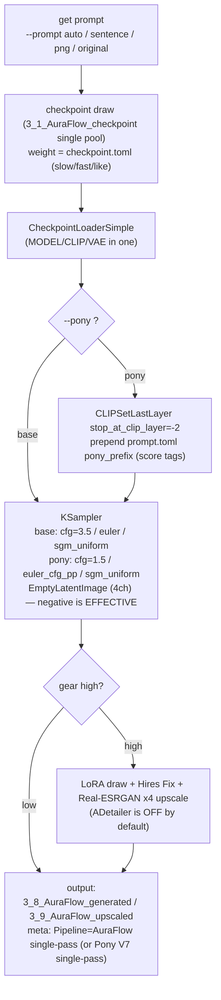

# AuraFlow Portrait Image Generation Environment

[日本語はこちら](README_ja.md)

An environment for creating portrait images with AuraFlow (and Pony Diffusion V7, an AuraFlow finetune). It drives ComfyUI over its HTTP API and handles everything from automatic tensor triage to continuous generation, upscaling, preview rendering, and gallery browsing, via CLI and GUI.

- **Target scope**: **AuraFlow (fal.ai MMDiT flow model) all-in-one safetensors**, plus **Pony Diffusion V7** (an AuraFlow finetune) via the `--pony` flag / GUI "Pony V7" toggle. Both share the same node graph; they differ only in recommended defaults and a score-tag prefix.
- **VRAM**: works from 8GB (verified on RTX 3060 Ti). The all-in-one checkpoint loads model + CLIP + VAE in one shot.
- Loading is **all-in-one only** (`CheckpointLoaderSimple`). AuraFlow / Pony V7 ship as a single safetensors that bundles the transformer, text encoder, and a SDXL-style 4-channel VAE.

> **About NSFW**: Pony Diffusion V7 is itself oriented toward character / NSFW-capable generation, so explicit content is possible. Whether (and how well) it is produced depends entirely on the checkpoint / LoRA you use. No censorship / filter is built into this tool.

## Console Language

Console output (logs, progress, `--help`) supports English and Japanese.
Choose the language with the `PLAYGROUND_LANG` env var (`en` / `ja`). If unset, it is auto-detected from the OS locale (Japanese environment → `ja`, otherwise → `en`).

``` powershell
$env:PLAYGROUND_LANG = "en"   # force English
$env:PLAYGROUND_LANG = "ja"   # force Japanese
```

Image metadata (the PNG `parameters` chunk, e.g. the `Pipeline:` field) is **always written in English** regardless of this setting.

## Setup

Install PyTorch **first**, matched to your environment (it is not in this project's `requirements.txt`). Then install ComfyUI and the Impact Pack / Impact Subpack.

### Windows

``` powershell
cd ~
git clone <this repository> auraflow_playground
cd auraflow_playground
python -m venv .venv
.\.venv\Scripts\Activate.ps1
# Install PyTorch first, matched to your environment (uninstall first when replacing a CPU build to avoid it being kept)
pip install --index-url https://download.pytorch.org/whl/cu128 torch torchvision
# Project dependencies (ComfyUI client only; does NOT include torch/diffusers)
pip install -r requirements.txt
# ComfyUI + custom nodes
git clone https://github.com/comfyanonymous/ComfyUI
cd ComfyUI\custom_nodes
git clone https://github.com/ltdrdata/ComfyUI-Impact-Pack
git clone https://github.com/ltdrdata/ComfyUI-Impact-Subpack
cd ..\..
pip install -r ComfyUI\requirements.txt
pip install -r ComfyUI\custom_nodes\ComfyUI-Impact-Pack\requirements.txt
pip install -r ComfyUI\custom_nodes\ComfyUI-Impact-Subpack\requirements.txt
```

### Linux/macOS

``` bash
cd ~
git clone <this repository> auraflow_playground
cd auraflow_playground
python -m venv .venv
source .venv/bin/activate
pip install --index-url https://download.pytorch.org/whl/cu128 torch torchvision
pip install -r requirements.txt
git clone https://github.com/comfyanonymous/ComfyUI
cd ComfyUI/custom_nodes
git clone https://github.com/ltdrdata/ComfyUI-Impact-Pack
git clone https://github.com/ltdrdata/ComfyUI-Impact-Subpack
cd ../..
pip install -r ComfyUI/requirements.txt
pip install -r ComfyUI/custom_nodes/ComfyUI-Impact-Pack/requirements.txt
pip install -r ComfyUI/custom_nodes/ComfyUI-Impact-Subpack/requirements.txt
```

### Placing models

| File | Destination | Notes |
|---|---|---|
| AuraFlow / Pony V7 all-in-one checkpoint (.safetensors) | `2_0_tensors/` (→ triaged to `3_1_AuraFlow_checkpoint`) | bundles model+clip+vae; loaded in one shot by `CheckpointLoaderSimple` |
| AuraFlow LoRA (.safetensors) | `2_0_tensors/` (→ `3_2_AuraFlow_LoRA`) | drawn during `--gear high` |
| (optional) external VAE (.safetensors) | `2_0_tensors/` (→ `3_4_AuraFlow_VAE`) | SDXL-style 4ch VAE override, used via `--vae` (the all-in-one bundles its own VAE) |

### (optional) Separate-loader path — using a transformer-only checkpoint

Normally the all-in-one checkpoint is all you need. Only when you want to use a **transformer-only checkpoint** (model weights only, no bundled CLIP/VAE — e.g. Pony V7's bf16 base) do you also need a **pile-T5 text encoder** and an **SDXL-style VAE**. `generate.py` auto-switches to the separate-loader path (`UNETLoader` + `CLIPLoader` + `VAELoader`) when the checkpoint is transformer-only (`--clip` / `--vae` then required).

```bash
# 1) Place the SDXL VAE (madebyollin/sdxl-vae-fp16-fix)
#    https://huggingface.co/madebyollin/sdxl-vae-fp16-fix/resolve/main/sdxl_vae.safetensors
#    → save as ComfyUI/models/vae/sdxl_vae.safetensors

# 2) Convert pile-T5-xl into a single ComfyUI text-encoder file
#    (auto-downloads from HF, extracts the encoder, writes one fp16 file)
python make_pile_t5_encoder.py --download
#    → produces ComfyUI/models/text_encoders/pile_t5xl_fp16.safetensors
#    NB: pile-T5 *xl* is required (large is hidden 1024, mismatching AuraFlow's 2048)

# 3) Generate with a transformer-only checkpoint (--clip / --vae required; on 8GB use --unet-dtype fp8_e4m3fn)
python generate.py --pony --checkpoint <transformer-only> \
  --clip pile_t5xl_fp16.safetensors --vae sdxl_vae.safetensors \
  --unet-dtype fp8_e4m3fn --sentence "a woman walking with umbrella outside"
```

> The SDXL VAE is a single file usable as-is. pile-T5-xl ships as an HF enc-dec model in 3 shards, so `make_pile_t5_encoder.py` extracts just the encoder and merges it into one file (ComfyUI's `CLIPLoader` wants a single file and detects the encoder signature as `T5_XL` → AuraT5).

### (optional) Prompt translation/refinement — Ollama + Gemma

AuraFlow's text encoder (pile-T5) is English-oriented, so Japanese prompts degrade quality. With the `--translate` flag, prompts are translated into natural English (and mixed JA/EN is unified) by a local LLM via [Ollama](https://ollama.com). This lets you write `prompt.toml` / `--sentence` / GUI prompts in Japanese and still feed clean English to the model.

This is **optional**: generation works without Ollama. When `--translate` is set but Ollama is unreachable, a warning is printed and the original prompt is used as-is (no pip package is added — it uses the already-required `requests`).

```bash
# 1) Install Ollama (external app; not a pip package)
#    https://ollama.com/download
# 2) Pull the model — gemma3:4b (~3.3GB Q4) is the realistic default
#    that coexists with AuraFlow generation on 8GB VRAM.
ollama pull gemma3:4b
#    (gemma3:12b is heavier and generally too much alongside generation on 8GB.)
# 3) Ollama runs a local server on http://localhost:11434 automatically.
```

Then add `--translate` to `generate.py` / `make_previews.py`, or tick the "翻訳/整形 (Gemma/Ollama)" checkbox in the GUI. Override the model/endpoint with `--ollama-model` / `--ollama-host` (defaults `gemma3:4b` / `http://localhost:11434`).

> Quality anchors (`positive_always`), `pony_prefix`, `negative_always`, and `**emphasis**` markers are protected — only the dynamic descriptive part is translated.

## Directory Layout

- `./` : scripts and config files
- `1_0_prompts` : place prompt-bearing PNGs here (for `--png` / `--png-sentence`)
- `2_0_tensors` : place tensors of unknown kind here (intake tray)
- `2_1_errortensors` : broken / duplicate / inpainting / **non-AuraFlow models (Flux.1 / Flux.2 / SDXL / SD15)** / undetectable (reject lane)
- `3_1_AuraFlow_checkpoint` : AuraFlow / Pony V7 checkpoints (all-in-one .safetensors)
- `3_2_AuraFlow_LoRA` : AuraFlow LoRAs
- `3_3_AuraFlow_ControlNet` : AuraFlow ControlNets (manual placement; not scanned)
- `3_4_AuraFlow_VAE` : AuraFlow / SDXL-style 4ch VAE
- `3_5_AuraFlow_Embedding` : AuraFlow Embeddings
- `3_8_AuraFlow_generated` : generated PNGs (with A1111-compatible metadata)
- `3_9_AuraFlow_upscaled` : upscaled PNGs (with metadata)

`dist_tensors.py` triages tensors by inspecting safetensors file headers.
**AuraFlow (incl. Pony V7) → `3_x_AuraFlow_*` / everything else (Flux.1・Flux.2・SDXL・SD15・broken・undetectable) → `2_1_errortensors`**.

## Quickest Workflow

1. Put checkpoint / LoRA / VAE tensors into `2_0_tensors`.

2. Run the triage.

```
python dist_tensors.py
```

3. Generate images.

```
python generate.py --sentence "a woman walking with umbrella outside"
# Pony V7 mode
python generate.py --pony --sentence "a woman walking with umbrella outside"
```

Normal images go to `3_8_AuraFlow_generated`, upscaled images to `3_9_AuraFlow_upscaled` (with `--gear high`).

> Run with the **`.venv` python** (ComfyUI is also auto-launched with the `.venv` python). When invoking from a shell, specify `.venv/Scripts/python.exe` explicitly.

## Generation Flow (diagram)

A single `generate.py` image roughly follows this flow.



Key points:

- **AuraFlow uses normal classifier-free guidance**: KSampler runs at **cfg=3.5** (base) or **cfg=1.5** (Pony V7). There is **no FluxGuidance node** — guidance is plain CFG. **The negative prompt is effective**, so `negative_always` genuinely works.
- **Quality of hands/face/body is asserted positively in the prompt** as well (write `detailed hands, five fingers` as a positive statement). `prompt.toml`'s `positive_always` holds this; `negative_always` complements it and is now active.
- **ADetailer is OFF by default.** On 8GB the per-region re-sampling is the heaviest step. Enable with `--adetailer` only when needed.
- **Pony V7 mode (`--pony`)** keeps the same graph but switches defaults (cfg=1.5 / `euler_cfg_pp` / 30 steps high gear / CLIP skip -2 via `CLIPSetLastLayer`) and prepends `prompt.toml`'s `pony_prefix` (score tags).
- Default resolution is **1024×1024**; landscape (many) is **1216×832**.

## Prompt Config: prompt.toml

Describes the keywords used to build prompts. Emphasis syntax: `*…*` (1.1x), `**…**` (1.3x), `***…***` (1.5x).

> The shipped `prompt.toml` is bilingual: the descriptive sections (who/wearing/motion/at/lighting) are written in **Japanese** and are meant to be used with `--translate` (Ollama+Gemma) to become natural English. The quality anchors (`positive_always` / `negative_always` / `pony_prefix`) and the `"nothing"` sentinel stay in English. Without `--translate`, Japanese text is sent to the model as-is (lower quality) — rewrite the sections in English if you don't use translation.

Each section is drawn and joined with commas into one positive. The **LoRA keywords** (below) of chosen entries are aggregated too.

- **who**: `[character, weight, has_wearing, has_motion, has_where, many, lora_kw]`

```
["**a woman**", 20, false, false, false, false, ""],
["**a school wear woman**", 10, true, false, false, false, "school wear"],
["**2 women kissing**", 5, true, true, false, true, "kiss"],
```

  - `has_wearing/has_motion/has_where` … true if embedded in the character string (skips that section); false to draw it
  - `many` … true for multi-person entries. When true, generates on a landscape canvas (`--many-width` × `--many-height`, default 1216×832) to suppress subject merging
- **wearing**: `["dress", 10, "dress"]` → "wearing dress". `""`/`"nothing"` → "naked"
- **with_items**: `["earring", 10, "jewel"]` → "with earring". Drawn up to 3 times
- **motion**: `["sitting", 50, ""]`
- **at**: `["beach", 5, ""]` → "at beach"
- **lighting**: uniform draw → "with {lighting}"
- **positive_always**: always appended at the end. Put quality tags + positive statements for hands/face/body here (e.g. `detailed hands with five fingers, anatomically correct body, ...`)
- **negative_always**: the negative body. Since **AuraFlow uses real CFG, the negative is now effective**, so this genuinely shapes the output (write what you want to suppress here)
- **pony_prefix**: Pony V7 score tags (e.g. `score_9, score_8_up, score_7_up, ...`). **Only applied in `--pony` mode**, prepended to the positive

> (Optional) Adding an `expression` section (a list of strings) appends one random expression/mood phrase per image (`build_prompt` handles it like `lighting`).

## Scripts

### Tensor triage: dist_tensors.py

```
python dist_tensors.py
```

Triages tensors in `2_0_tensors` (also unzips / converts ckpt→safetensors / detects hash duplicates; safe to run repeatedly).

- From safetensors headers, determines **kind** (base / lora / controlnet / vae / embedding / inpainting / broken) and **family**. AuraFlow (incl. Pony V7) is identified by MMDiT key signatures (`double_layers` / `single_layers` / `cond_seq_linear` / `init_x_linear` / `register_tokens`) or `auraflow` in metadata.
- Destinations: **AuraFlow → `3_1`–`3_5` / everything else (Flux.1・Flux.2・SDXL・SD15・broken・undetectable) → `2_1_errortensors`**.
- For hash duplicates, keeps the newer mtime and moves the older to `2_1_errortensors`. `3_3_AuraFlow_ControlNet` / `2_1` are not scanned (manual placement respected).
- Linked files: `tensors_cache.toml` (hash cache), `AuraFlow_LoRA_hint.toml` (LoRA subject), `checkpoint.toml` (appends unregistered checkpoints; `family` still guesses pony/2d/real from the filename), `AuraFlow_categories` in `LoRA_preview.toml` (adds missing as `ware`).
- Note: an AuraFlow VAE and an SDXL VAE are header-indistinguishable (both 4ch), so the tool accepts a standalone 4ch VAE into `3_4_AuraFlow_VAE`.

In `AuraFlow_LoRA_hint.toml`, only **`subject="pose"`** is functional (pose LoRAs are auto-excluded when OpenPose is in use).

### Generation: generate.py

```
python generate.py
python generate.py --pony          # Pony V7 defaults
```

Generates images continuously. The `dist_tensors` triage runs first. Output goes to `3_8_AuraFlow_generated`・`3_9_AuraFlow_upscaled` as `YYYYMMDDHHMMSS.png`. Default is continuous run with no cooldown (rely on the GPU's thermal throttling — minimizes heat/cool thermal cycling, kinder to hardware lifespan). Use `--cooldown <sec>` to set an explicit per-image wait. `Ctrl+C` to stop.

#### Prompt (input source)

- none (`--prompt auto`, default): build from `prompt.toml` and generate continuously
- `--sentence "<text>" [--lora-keywords "kw,..."]`: continuous generation from text + LoRA keywords
- `--png <PNG>`: quality-up refine via **img2img** of that image (**single image, then exits**). `--refine-denoise` (default 0.5)
- `--png-sentence <PNG>`: continuous generation from the PNG's embedded prompt text (the image itself is not used)
- `--prompt original --png-sentence <PNG>`: reuse all of the PNG's checkpoint・LoRA・prompt metadata

#### Checkpoint draw / checkpoint.toml

Fix with `--checkpoint <name>`. The pool is the single `3_1_AuraFlow_checkpoint` (.safetensors). The first pick is a random unmeasured one; later picks are 2/3 measured (weighted) / 1/3 unmeasured. Weight = `((max slow*2)-(fast+slow))/2+like`.

`checkpoint.toml` fields:
- `slow` / `fast` : max / min time for one image (s)
- `like` : preference (signed; added to draw weight)
- `inference` : extra inference steps (signed)
- `style` : `anime` / `real` / `mix` / `""` (used for upscale-model selection)
- `family` : filename-guessed family tag (pony / 2d / real; informational; auto-appended on first `--gear high` if unregistered)

#### Gear

- `--gear low` : rough generation (20 steps, plain txt2img, no LoRA/ControlNet/Hires/upscale/ADetailer)
- `--gear high` : production (28 steps — **30 in `--pony` mode** —, LoRA draw, Hires Fix, Real-ESRGAN x4 upscale). **ADetailer OFF by default**

`--gear high` is the default.

#### Main options

- `--pony` : Pony V7 mode (cfg=1.5 / `euler_cfg_pp` / 30 steps high gear / CLIP skip -2 / prepend `pony_prefix`)
- `--cfg-scale` (default **3.5**, auto **1.5** with `--pony`)
- `--sampler` / `--scheduler` (auto-resolved by mode: base = `euler` / `sgm_uniform`, pony = `euler_cfg_pp` / `sgm_uniform`)
- `--width` / `--height` (default 1024) / `--many` / `--many-width` / `--many-height` (default 1216×832)
- `--vae <name>` : use an external 4ch VAE from `3_4_AuraFlow_VAE` via VAELoader (otherwise the bundled VAE is used)
- `--adetailer` : enable ADetailer (OFF by default)
- `--hires-fix` / `--no-hires-fix`, `--upscale` / `--no-upscale` : override the gear-linked defaults
- `--lora-scale` (total 0.8) / `--lora-stack-min` (3) / `--lora-stack-max` (5, 0 disables LoRA)
- `--arch cuda|cpu` (default cuda) / `--cooldown` / `--seed`
- `--translate` : translate/refine the prompt into natural English via Ollama+Gemma (optional; see Setup). `--ollama-model` (default `gemma3:4b`) / `--ollama-host` (default `http://localhost:11434`). On failure the original prompt is used

#### LoRA keywords / draw

A word list, separate from the prompt text, that selects LoRAs. Case-insensitive; space = AND, comma = OR.
Decide LoRA count (default 3–5) → draw by keywords (97% searches LoRA name/meta/`LoRA_keywords.toml`, 3% from all LoRAs).
LoRA keywords are appended to the positive with weight `(0.8/count)*word`. Check combinations with `lora_chance_ui.py`.

#### ControlNet

Fix with `--controlnet <name>`. Applied when `3_3_AuraFlow_ControlNet` has files and a reference image (`--png` etc.) is present. `--pose <PNG>` forces OpenPose (requires an openpose-type file in `3_3_AuraFlow_ControlNet`).
Note: ControlNet and preprocessor nodes (`DWPreprocessor` etc.) require separate custom nodes.

#### Workflow visualization (debug)

- `--dump-workflow` : also save the submitted workflow to `workflow_dump/<time>_<kind>.json` (generation runs normally)
- `--dump-only` : only emit the workflow JSON without submitting to ComfyUI (no GPU; one image then exits)

Drag the output JSON onto the ComfyUI WebUI canvas (http://127.0.0.1:8188) to visualize the graph.

### Image Generation GUI: generate_gui.py

```
python generate_gui.py
```

A manual image-generation GUI (Tkinter). Generate 1–300 images in batches with instant gallery display.

- **Checkpoint**: select from `3_1_AuraFlow_checkpoint`. Thumbnails (`<name>.preview.png`) shown alongside
- **LoRA**: multi-select from `3_2_AuraFlow_LoRA`. **ControlNet**: `3_3_AuraFlow_ControlNet` (wired when a reference image is dropped)
- **Settings dialog** (persisted to `generate_gui.toml`): CFG (default 3.5) / **Pony V7 checkbox** / Steps / Seed / width / height / Sampler (euler default) / Scheduler (sgm_uniform default) / LoRA total strength / AD correction (OFF by default) / Hires options
- **翻訳/整形 checkbox**: translate/refine the prompt into natural English via Ollama+Gemma (optional; original prompt is used when Ollama is not running)
- **Gallery**: thumbnails added per image. Click for full size; right-click to delete / upscale
- Output to `3_8_AuraFlow_generated` / `3_9_AuraFlow_upscaled`

### Preview Rendering: make_previews.py

```
python make_previews.py                      # all checkpoints + LoRAs (skips existing sidecars)
python make_previews.py --pony               # render with Pony V7 defaults
python make_previews.py --only lora --limit 2
python make_previews.py --dry-run            # show plan without generating
python make_previews.py --init-categories    # initialize AuraFlow_categories
python make_previews.py --translate          # translate/refine prompts via Ollama+Gemma
```

Renders `<name>.preview.png` sidecars per tensor. Checkpoints use themselves; LoRAs use a representative base from `3_1_AuraFlow_checkpoint` (specifiable via `--base`) + trigger words for one image. Defaults: cfg=3.5 / euler / sgm_uniform (or Pony V7 defaults with `--pony`). `--translate` (with `--ollama-model` / `--ollama-host`) refines prompts into English via Ollama+Gemma (optional; see Setup).

### Tensor Info Viewer: tensors_view.py

```
python tensors_view.py [--dir <directory>] [--list]
```

A Tkinter viewer that raw-reads `safetensors` headers to list metadata, tensor count, dtype, and size (torch-free).
Detects family as auraflow / SDXL / SD15 (non-AuraFlow families retained for browsing legacy tensors in `2_1_errortensors`). Supports sidecar preview display/regeneration and editing LoRA preview categories (`AuraFlow_categories` / `AuraFlow_prompts` in `LoRA_preview.toml`). When `--dir` is omitted, opens the first entry of `preview_settings.toml [tensors_dirs].list`.

### Image Gallery: gallery.py

```
python gallery.py [--list]
```

A read-only Tkinter viewer that recursively scans `3_8_AuraFlow_generated` / `3_9_AuraFlow_upscaled`. Reads A1111-compatible metadata for thumbnails + a metadata list, with search/sort/filter. Detects and color-codes AuraFlow via the `Pipeline` field.

### PNG Prompt Utility: pngutil.py

```
python pngutil.py <PNG file>            # inspect
python pngutil.py <PNG> --sentence "..." # change prompt text
python pngutil.py <PNG> --lora "..."     # change LoRA keywords
python pngutil.py <PNG> --erase          # remove text info
```

For a prompt-bearing PNG viewer, [stable-diffusion-prompt-reader](https://github.com/receyuki/stable-diffusion-prompt-reader) is handy.

### LoRA Selection-Probability Check: lora_chance_ui.py

```
python lora_chance_ui.py
```

Graphs the top-30 LoRA selection probabilities over 300 draws (`random` / `manual` / `lora_keyword`).

## Config Files

- `prompt.toml` : prompt-building keywords (above; includes `pony_prefix`)
- `checkpoint.toml` : checkpoint info (slow/fast/like/inference/style/family)
- `LoRA_keywords.toml` : per-LoRA search keywords
- `AuraFlow_LoRA_hint.toml` : LoRA subject (only `pose` is functional)
- `LoRA_preview.toml` : `[AuraFlow_categories]` (stem→category) / `[AuraFlow_prompts]` (stem→custom positive)
- `preview_settings.toml` : `[tensors_dirs]` (viewer candidate dirs) / `[LoRA_preview_template]` / `[checkpoint_preview_template]`
- `tensors_cache.toml` : dist_tensors hash cache (auto-generated)
- `generate_gui.toml` : GUI persisted settings (auto-generated)

## ADetailer Model Auto-Placement

When using `--adetailer`, the following are auto-downloaded if missing.
- `ComfyUI/models/ultralytics/bbox/face_yolov8s.pt`
- `ComfyUI/models/ultralytics/bbox/hand_yolov8s.pt`
- `ComfyUI/models/ultralytics/segm/person_yolov8s-seg.pt`

## License

GPL-3.0
