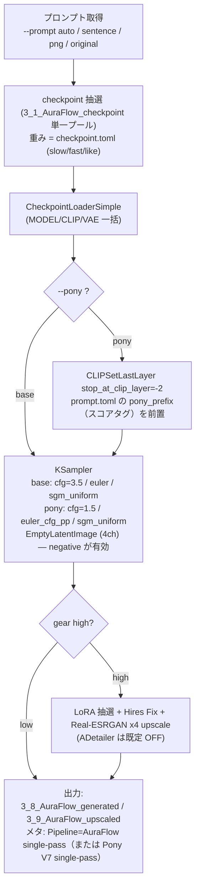

# AuraFlow 人物画像生成環境

[English here](README.md)

AuraFlow（および AuraFlow の finetune である Pony Diffusion V7）の人物画像制作環境です。ComfyUI を HTTP API 経由で叩き、テンソルの自動振り分けから連続生成・アップスケール・プレビュー・ギャラリー閲覧までを CLI / GUI でまとめて行います。

- **対象スコープ**: **AuraFlow（fal.ai の MMDiT flow モデル）の all-in-one safetensors**、および `--pony` フラグ / GUI「Pony V7」トグルで使える **Pony Diffusion V7**（AuraFlow の finetune）。両者は同じノードグラフを共有し、推奨デフォルト値とスコアタグの prefix だけが異なる。
- **VRAM**: 8GB から動作（RTX 3060 Ti で検証）。all-in-one checkpoint が model + CLIP + VAE を一括ロードする。
- ロードは **all-in-one のみ**（`CheckpointLoaderSimple`）。AuraFlow / Pony V7 は transformer・テキストエンコーダ・SDXL 系の 4ch VAE を同梱した単一 safetensors として配布される。

> **NSFW について**: Pony Diffusion V7 はキャラクター / NSFW 寄りの生成を志向したモデルであり、露骨表現も生成可能。実際に出るか（どの程度出るか）は使用する checkpoint / LoRA に完全に依存する。フィルタ等の検閲は本ツール側には入っていません。

## コンソール言語

コンソール出力（ログ・進捗・`--help`）は英語／日本語に対応。
言語は環境変数 `PLAYGROUND_LANG`（`en` / `ja`）で選ぶ。未設定なら OS ロケールから自動判定（日本語環境→`ja`、その他→`en`）。

``` powershell
$env:PLAYGROUND_LANG = "en"   # 英語に固定
$env:PLAYGROUND_LANG = "ja"   # 日本語に固定
```

画像メタデータ（PNG の `parameters` チャンク、例 `Pipeline:` フィールド）は、この設定に関わらず**常に英語**で書き出される。

## 初期設定

PyTorch は環境に合わせて**先に**入れる（本体の `requirements.txt` には含めない）。その後 ComfyUI と Impact Pack / Impact Subpack を導入する。

### Windows

``` powershell
cd ~
git clone <このリポジトリ> auraflow_playground
cd auraflow_playground
python -m venv .venv
.\.venv\Scripts\Activate.ps1
# PyTorch を環境に合わせて先に入れる（CPU 版に上書きされる事故を避けるため、入れ替え時は uninstall してから）
pip install --index-url https://download.pytorch.org/whl/cu128 torch torchvision
# 本体の依存（ComfyUI クライアントのみ。torch/diffusers は含まない）
pip install -r requirements.txt
# ComfyUI 本体 + custom node
git clone https://github.com/comfyanonymous/ComfyUI
cd ComfyUI\custom_nodes
git clone https://github.com/ltdrdata/ComfyUI-Impact-Pack
git clone https://github.com/ltdrdata/ComfyUI-Impact-Subpack
cd ..\..
pip install -r ComfyUI\requirements.txt
pip install -r ComfyUI\custom_nodes\ComfyUI-Impact-Pack\requirements.txt
pip install -r ComfyUI\custom_nodes\ComfyUI-Impact-Subpack\requirements.txt
```

### Linux/macOS

``` bash
cd ~
git clone <このリポジトリ> auraflow_playground
cd auraflow_playground
python -m venv .venv
source .venv/bin/activate
pip install --index-url https://download.pytorch.org/whl/cu128 torch torchvision
pip install -r requirements.txt
git clone https://github.com/comfyanonymous/ComfyUI
cd ComfyUI/custom_nodes
git clone https://github.com/ltdrdata/ComfyUI-Impact-Pack
git clone https://github.com/ltdrdata/ComfyUI-Impact-Subpack
cd ../..
pip install -r ComfyUI/requirements.txt
pip install -r ComfyUI/custom_nodes/ComfyUI-Impact-Pack/requirements.txt
pip install -r ComfyUI/custom_nodes/ComfyUI-Impact-Subpack/requirements.txt
```

### モデルの配置

| ファイル | 配置先 | 備考 |
|---|---|---|
| AuraFlow / Pony V7 all-in-one checkpoint（.safetensors） | `2_0_tensors/`（→振り分けで `3_1_AuraFlow_checkpoint`） | model+clip+vae 同梱。`CheckpointLoaderSimple` で一括ロード |
| AuraFlow LoRA（.safetensors） | `2_0_tensors/`（→`3_2_AuraFlow_LoRA`） | `--gear high` 時に抽選される |
| （任意）外部 VAE（.safetensors） | `2_0_tensors/`（→`3_4_AuraFlow_VAE`） | SDXL 系 4ch VAE の上書き。`--vae` で使用（all-in-one は同梱 VAE を持つ） |

### （任意）分離ローダー経路 — transformer 単体 checkpoint を使う場合

通常は all-in-one checkpoint だけで完結する。**transformer 単体（model のみ・CLIP/VAE 非同梱）の checkpoint**（例: Pony V7 の bf16 base）を使いたいときだけ、別途 **pile-T5 テキストエンコーダ**と **SDXL 系 VAE** が必要。`generate.py` は checkpoint が transformer 単体だと自動で分離ローダー経路（`UNETLoader` + `CLIPLoader` + `VAELoader`）に切り替える（`--clip` / `--vae` が必須）。

```powershell
# 1) SDXL VAE を配置 (madebyollin/sdxl-vae-fp16-fix)
#    https://huggingface.co/madebyollin/sdxl-vae-fp16-fix/resolve/main/sdxl_vae.safetensors
#    → ComfyUI\models\vae\sdxl_vae.safetensors として保存

# 2) pile-T5-xl を ComfyUI 用 encoder 1 ファイルに変換 (HF から自動 DL → encoder 抽出 → fp16 1 ファイル化)
python make_pile_t5_encoder.py --download
#    → ComfyUI\models\text_encoders\pile_t5xl_fp16.safetensors を生成
#    ※ pile-T5 は xl が必須 (large は hidden 1024 で AuraFlow の 2048 と不一致のため使えない)

# 3) transformer 単体 checkpoint で生成 (--clip / --vae 必須、8GB は --unet-dtype fp8_e4m3fn 推奨)
python generate.py --pony --checkpoint <transformer単体> `
  --clip pile_t5xl_fp16.safetensors --vae sdxl_vae.safetensors `
  --unet-dtype fp8_e4m3fn --sentence "a woman walking with umbrella outside"
```

> SDXL VAE は単一ファイルでそのまま使える。pile-T5-xl は HF 形式の enc-dec・3 シャードなので、`make_pile_t5_encoder.py` で encoder だけ抜き出して 1 ファイルに統合する（ComfyUI の `CLIPLoader` は単一ファイル・encoder 署名で `T5_XL` → AuraT5 と自動判定する）。

### （任意）プロンプトの翻訳／整形 — Ollama + Gemma

AuraFlow のテキストエンコーダ（pile-T5）は英語志向のため、日本語プロンプトは品質が落ちる。`--translate` フラグを付けると、ローカル LLM（[Ollama](https://ollama.com) 経由の Gemma）がプロンプトを自然な英語に翻訳する（日英混在も統一）。これにより `prompt.toml` / `--sentence` / GUI のプロンプトを日本語で書いても、モデルにはきれいな英語を渡せる。

これは**任意機能**で、Ollama が無くても生成は動く。`--translate` 指定時に Ollama へ接続できない場合は警告を出して原文をそのまま使う（pip パッケージは追加しない。既存依存の `requests` を使う）。

```powershell
# 1) Ollama を導入（外部アプリ。pip パッケージではない）
#    https://ollama.com/download
# 2) モデルを pull — gemma3:4b（約 3.3GB Q4）が、8GB VRAM で
#    AuraFlow 生成と同居できる現実的な既定。
ollama pull gemma3:4b
#    （gemma3:12b は重く、8GB では生成と同居は厳しい。）
# 3) Ollama は http://localhost:11434 でローカルサーバを自動起動する。
```

あとは `generate.py` / `make_previews.py` に `--translate` を付けるか、GUI の「翻訳/整形 (Gemma/Ollama)」チェックボックスを ON にする。モデル/接続先は `--ollama-model` / `--ollama-host` で上書き可（既定 `gemma3:4b` / `http://localhost:11434`）。

> 品質アンカー（`positive_always`）・`pony_prefix`・`negative_always`・`**強調**` マーカーは保護され、翻訳されるのは動的な描写部分のみ。

## ディレクトリ構成

- `./` : スクリプト・設定ファイル
- `1_0_prompts` ： プロンプト入りの PNG をユーザが配置する（`--png` / `--png-sentence` 用）
- `2_0_tensors` ： 種別不明なテンソルをユーザが配置する（受入トレー）
- `2_1_errortensors` ： 破損 / 重複 / inpainting / **AuraFlow 以外のモデル（Flux.1 / Flux.2 / SDXL / SD15）** / 判別不能（リジェクトレーン）
- `3_1_AuraFlow_checkpoint` ： AuraFlow / Pony V7 checkpoint（all-in-one .safetensors）
- `3_2_AuraFlow_LoRA` ： AuraFlow LoRA
- `3_3_AuraFlow_ControlNet` ： AuraFlow ControlNet（手動配置、scan しない）
- `3_4_AuraFlow_VAE` ： AuraFlow / SDXL 系 4ch VAE
- `3_5_AuraFlow_Embedding` ： AuraFlow Embedding
- `3_8_AuraFlow_generated` ： 生成された PNG（A1111 互換メタ付き）が出力される
- `3_9_AuraFlow_upscaled` ： アップスケール後 PNG（メタ付き）が出力される

テンソルは `dist_tensors.py` が safetensors のファイルヘッダを見て自動振り分けする。
**AuraFlow（Pony V7 含む） → `3_x_AuraFlow_*` / それ以外（Flux.1・Flux.2・SDXL・SD15・破損・判別不能） → `2_1_errortensors`**。

## 一番簡単な使い方

1. checkpoint / LoRA / VAE テンソルを `2_0_tensors` に入れる。

2. テンソル振り分けを実行する。

```
python dist_tensors.py
```

3. 画像生成を実行する。

```
python generate.py --sentence "a woman walking with umbrella outside"
# Pony V7 モード
python generate.py --pony --sentence "a woman walking with umbrella outside"
```

`3_8_AuraFlow_generated` に通常画像、`3_9_AuraFlow_upscaled` にアップスケール画像が出力される（`--gear high` 時）。

> 実行は **`.venv` の python**（ComfyUI も `.venv` の python で自動起動される）。Bash 等で叩く場合は `.venv/Scripts/python.exe` を明示すること。

## 生成フロー（概念図）

`generate.py` 1 枚の生成は、おおむね次の流れで進む。



要点:

- **AuraFlow は通常の classifier-free guidance を使う**: KSampler は **cfg=3.5**（base）または **cfg=1.5**（Pony V7）で回す。**FluxGuidance ノードは無い** ── 誘導は素の CFG で行う。**negative プロンプトは有効**で、`negative_always` がきちんと効く。
- **手・顔・身体の良好さは positive にも肯定文で明記**する（`detailed hands, five fingers` を肯定文で書く）。`prompt.toml` の `positive_always` がこれを持ち、`negative_always` がこれを補完して有効に働く。
- **ADetailer は既定 OFF**。8GB では検出領域ごとの再サンプリングが最も重い。必要時のみ `--adetailer`。
- **Pony V7 モード（`--pony`）** はグラフ自体は同じで、デフォルト値を切り替える（cfg=1.5 / `euler_cfg_pp` / high gear 30 step / `CLIPSetLastLayer` で CLIP skip -2）うえ、`prompt.toml` の `pony_prefix`（スコアタグ）を前置する。
- 解像度の既定は **1024×1024**、横長 many は **1216×832**。

## プロンプト設定ファイル prompt.toml

プロンプトを生成するキーワードを記述する。重み記法あり：`*～*`（1.1倍）、`**～**`（1.3倍）、`***～***`（1.5倍）。

> 同梱の `prompt.toml` はバイリンガル構成：描写セクション（who/wearing/motion/at/lighting）は**日本語**で書かれており、`--translate`（Ollama+Gemma）で自然な英語に変換して使う前提。品質アンカー（`positive_always` / `negative_always` / `pony_prefix`）と `"nothing"` センチネルは英語のまま。`--translate` を使わない場合、日本語はそのままモデルに渡る（品質低下）ので、翻訳を使わないなら各セクションを英語で書き直すこと。

各セクションから抽選 → カンマ連結で 1 つの positive を組む。採用エントリの **LoRA キーワード**（後述）も集約される。

- **who**（だれが）：`[character, weight, has_wearing, has_motion, has_where, many, lora_kw]`

```
["**a woman**", 20, false, false, false, false, ""],
["**a school wear woman**", 10, true, false, false, false, "school wear"],
["**2 women kissing**", 5, true, true, false, true, "kiss"],
```

  - `has_wearing/has_motion/has_where` … キャラ文字列に内包していれば true（対応セクションをスキップ）、抽選させるなら false
  - `many` … 複数人エントリなら true。true のとき横長キャンバス（`--many-width` × `--many-height`、既定 1216×832）で人物融合を抑える
- **wearing**（着ているもの）：`["dress", 10, "dress"]` →「wearing dress」。`""`/`"nothing"` は「naked」
- **with_items**（装飾品・状況）：`["earring", 10, "jewel"]` →「with earring」。最大 3 回抽選
- **motion**（動作）：`["sitting", 50, ""]`
- **at**（場所）：`["beach", 5, ""]` →「at beach」
- **lighting**（照明）：均等抽選 →「with {lighting}」
- **positive_always**：必ず末尾に付加。品質タグ + 手/顔/身体の肯定文をここに置く（例：`detailed hands with five fingers, anatomically correct body, ...`）
- **negative_always**：negative の本体。**AuraFlow は実 CFG なので negative が有効になった**ため、ここで出力をきちんと制御できる（抑制したいものを書く）
- **pony_prefix**：Pony V7 のスコアタグ（例 `score_9, score_8_up, score_7_up, ...`）。**`--pony` モードのときだけ** positive の先頭に前置される

> （任意）`expression` セクション（文字列のリスト）を足すと、表情/ムードを毎枚ランダムに 1 句付加できる（`build_prompt` が `lighting` 同様に処理）。

## スクリプト

### テンソル振り分け dist_tensors.py

```
python dist_tensors.py
```

`2_0_tensors` のテンソルを振り分ける（zip 展開 / ckpt→safetensors 変換 / ハッシュ重複検出も行う、何度実行しても安全）。

- safetensors ヘッダから **kind**（base / lora / controlnet / vae / embedding / inpainting / broken）と **系統** を判定。AuraFlow（Pony V7 含む）は MMDiT のキー特徴（`double_layers` / `single_layers` / `cond_seq_linear` / `init_x_linear` / `register_tokens`）またはメタ中の `auraflow` で識別する。
- 振り分け先：**AuraFlow → `3_1`〜`3_5` / それ以外（Flux.1・Flux.2・SDXL・SD15・破損・判別不能） → `2_1_errortensors`**。
- ハッシュ重複は mtime の新しい方を残し、古い方を `2_1_errortensors` へ。`3_3_AuraFlow_ControlNet` / `2_1` は scan しない（手動配置を尊重）。
- 連動ファイル：`tensors_cache.toml`（ハッシュ等キャッシュ）、`AuraFlow_LoRA_hint.toml`（LoRA の subject）、`checkpoint.toml`（未登録 checkpoint を追記。`family` は今もファイル名から pony/2d/real を推定）、`LoRA_preview.toml` の `AuraFlow_categories`（不足分を `ware` で追記）。
- ※ AuraFlow VAE と SDXL VAE はヘッダ上区別できない（どちらも 4ch）ため、単体の 4ch VAE は `3_4_AuraFlow_VAE` に受け入れる。

`AuraFlow_LoRA_hint.toml` の `subject` で機能的に意味を持つのは **`subject="pose"`** のみ（OpenPose 使用時に pose 系 LoRA を自動除外）。

### 生成 generate.py

```
python generate.py
python generate.py --pony          # Pony V7 の既定値
```

画像を連続生成する。生成前に `dist_tensors` の振り分けが走る。出力は `3_8_AuraFlow_generated`・`3_9_AuraFlow_upscaled` に `YYYYMMDDHHMMSS.png`。既定は cooldown なしの連続運転（GPU のサーマルスロットリング任せ＝加熱／冷却の熱サイクルを抑え寿命に優しい）。`--cooldown <秒>` で枚ごとの待機を明示指定可。`Ctrl+C` で終了。

#### プロンプト（入力ソース）

- 指定なし（`--prompt auto` 既定）：`prompt.toml` から生成して連続生成
- `--sentence "<文章>" [--lora-keywords "kw,..."]`：文章 + LoRA キーワードで連続生成
- `--png <PNG>`：その画像を **img2img** で描き直す画質アップ refine（**1 枚で終了**）。`--refine-denoise`（既定 0.5）
- `--png-sentence <PNG>`：PNG の埋込プロンプト『文章』で連続生成（画像は使わない）
- `--prompt original --png-sentence <PNG>`：PNG メタの checkpoint・LoRA・プロンプトを全部流用

#### checkpoint 抽選 / checkpoint.toml

`--checkpoint <name>` で固定。プールは `3_1_AuraFlow_checkpoint` 単一（.safetensors）。1 度めは未計測をランダム、2 度め以降は 2/3 で計測済み（重み付き）/ 1/3 で未計測。重み = `((slow最大*2)-(fast+slow))/2+like`。

`checkpoint.toml` の項目：
- `slow` / `fast` ： 1 枚生成の最大 / 最小時間(s)
- `like` ： 好み（正負値、抽選重みに加算）
- `inference` ： 追加推論ステップ（正負値）
- `style` ： `anime` / `real` / `mix` / `""`（アップスケールモデル選択に使用）
- `family` ： ファイル名推定の系統タグ（pony / 2d / real。情報用。`--gear high` 初回に未登録なら自動追記）

#### ギア

- `--gear low` ： ラフ生成（推論数 **20**・純 txt2img・LoRA/ControlNet/Hires/upscale/ADetailer なし）
- `--gear high` ： 本番生成（推論数 **28** ── **`--pony` モードでは 30** ──・LoRA 抽選・Hires Fix・Real-ESRGAN x4 upscale）。**ADetailer は既定 OFF**

`--gear high` が既定。

#### 主なオプション

- `--pony` ： Pony V7 モード（cfg=1.5 / `euler_cfg_pp` / high gear 30 step / CLIP skip -2 / `pony_prefix` 前置）
- `--cfg-scale`（既定 **3.5**、`--pony` 時は自動 **1.5**）
- `--sampler` / `--scheduler`（モードで自動決定：base = `euler` / `sgm_uniform`、pony = `euler_cfg_pp` / `sgm_uniform`）
- `--width` / `--height`（既定 1024） / `--many` / `--many-width` / `--many-height`（既定 1216×832）
- `--vae <name>` ： `3_4_AuraFlow_VAE` の外部 4ch VAE を VAELoader で使用（未指定なら同梱 VAE）
- `--adetailer` ： ADetailer を明示 ON（既定 OFF）
- `--hires-fix` / `--no-hires-fix` ・ `--upscale` / `--no-upscale` ： gear 連動の既定を上書き
- `--lora-scale`（合計 0.8） / `--lora-stack-min`（3） / `--lora-stack-max`（5、0 で LoRA OFF）
- `--arch cuda|cpu`（既定 cuda） / `--cooldown` / `--seed`
- `--translate` ： Ollama+Gemma でプロンプトを自然な英語に翻訳／整形（任意。初期設定参照）。`--ollama-model`（既定 `gemma3:4b`）/ `--ollama-host`（既定 `http://localhost:11434`）。失敗時は原文を使用

#### LoRA キーワード・抽選方式

文章とは別に LoRA を抽選するワード列。大小文字区別なし、スペース区切り=AND、コンマ区切り=OR。
LoRA 数決定（既定 3〜5）→ キーワードで抽選（97% は LoRA 名/メタ/`LoRA_keywords.toml` を検索、3% は全 LoRA から）。
LoRA キーワードは `(0.8/語数)*語` の重みで positive 末尾に加わる。組み合わせは `lora_chance_ui.py` で確認可。

#### ControlNet

`--controlnet <name>` で固定。`3_3_AuraFlow_ControlNet` にファイルがあり、リファレンス画像（`--png` 等）がある場合に適用。`--pose <PNG>` で OpenPose 強制（`3_3_AuraFlow_ControlNet` に openpose 系が必要）。
※ ControlNet と前処理ノード（`DWPreprocessor` 等）は別途 custom node が必要。

#### workflow の可視化（デバッグ）

- `--dump-workflow` ： 投入する workflow を `workflow_dump/<時刻>_<種別>.json` に保存（生成は通常実行）
- `--dump-only` ： workflow JSON を吐くだけで ComfyUI へ投入しない（GPU 不使用、1 枚分で即終了）

出力 JSON を ComfyUI WebUI（http://127.0.0.1:8188）のキャンバスにドラッグするとグラフを可視化できる。

### 画像生成 GUI generate_gui.py

```
python generate_gui.py
```

マニュアル指定型の画像生成 GUI（Tkinter）。1〜300 枚をまとめて生成しつつギャラリーに即時表示。

- **チェックポイント**：`3_1_AuraFlow_checkpoint` を選択。サムネ（`<name>.preview.png`）を横に表示
- **LoRA**：`3_2_AuraFlow_LoRA` を複数選択。**ControlNet**：`3_3_AuraFlow_ControlNet`（リファレンス画像 D&D 時に配線）
- **設定ダイアログ**（`generate_gui.toml` に永続化）：CFG（既定 3.5）/ **Pony V7 チェックボックス** / Steps / Seed / 幅 / 高さ / Sampler（euler 既定）/ Scheduler（sgm_uniform 既定）/ LoRA 合計強度 / AD 補正（既定 OFF）/ Hires 各種
- **翻訳/整形 チェックボックス**：Ollama+Gemma でプロンプトを自然な英語に翻訳／整形（任意。Ollama 未起動時は原文を使用）
- **ギャラリー**：生成ごとにサムネ追加。クリックで原寸、右クリックで削除 / アップスケール
- 出力は `3_8_AuraFlow_generated` / `3_9_AuraFlow_upscaled`

### プレビュー生成 make_previews.py

```
python make_previews.py                      # 全 checkpoint + LoRA（既存サイドカーはスキップ）
python make_previews.py --pony               # Pony V7 の既定値で生成
python make_previews.py --only lora --limit 2
python make_previews.py --dry-run            # 生成せず計画表示
python make_previews.py --init-categories    # AuraFlow_categories を初期化
python make_previews.py --translate          # Ollama+Gemma でプロンプトを翻訳／整形
```

各テンソルの `<name>.preview.png` サイドカーを焼く。checkpoint はそのモデルで、LoRA は `3_1_AuraFlow_checkpoint` の代表ベース（`--base` で指定可）+ トリガー語で 1 枚。既定（cfg=3.5 / euler / sgm_uniform。`--pony` 時は Pony V7 既定）。`--translate`（`--ollama-model` / `--ollama-host`）で Ollama+Gemma によるプロンプト英訳／整形が可能（任意。初期設定参照）。

### テンソル情報ビューア tensors_view.py

```
python tensors_view.py [--dir <directory>] [--list]
```

`safetensors` ヘッダを生読みしてメタ・テンソル数・dtype・サイズを一覧する Tkinter ビューア（torch 非依存）。
系統は auraflow / SDXL / SD15 を判定（AuraFlow 以外の系統は `2_1_errortensors` の旧テンソル閲覧用に残置）。サイドカープレビュー表示・再生成、LoRA のプレビューカテゴリ編集（`LoRA_preview.toml` の `AuraFlow_categories` / `AuraFlow_prompts`）に対応。`--dir` 省略時は `preview_settings.toml [tensors_dirs].list` の先頭。

### 画像ギャラリー gallery.py

```
python gallery.py [--list]
```

`3_8_AuraFlow_generated` / `3_9_AuraFlow_upscaled` を再帰走査する閲覧専用ビューア（Tkinter）。A1111 互換メタを読んでサムネ + メタ一覧、検索・ソート・フィルタ。`Pipeline` フィールドで AuraFlow を判定・色分け。

### PNG プロンプトユーティリティ pngutil.py

```
python pngutil.py <PNG file>            # 確認
python pngutil.py <PNG> --sentence "..." # 文章プロンプトを変更
python pngutil.py <PNG> --lora "..."     # LoRA キーワードを変更
python pngutil.py <PNG> --erase          # テキスト情報を削除
```

プロンプト入り PNG ビューアは [stable-diffusion-prompt-reader](https://github.com/receyuki/stable-diffusion-prompt-reader) が便利。

### LoRA 選択確率確認 lora_chance_ui.py

```
python lora_chance_ui.py
```

300 回の抽選で選ばれる LoRA の確率 Top30 をグラフ表示（`random` / `manual` / `lora_keyword`）。

## 設定ファイル一覧

- `prompt.toml` ： プロンプト生成キーワード（上記。`pony_prefix` を含む）
- `checkpoint.toml` ： checkpoint の補足情報（slow/fast/like/inference/style/family）
- `LoRA_keywords.toml` ： LoRA ごとの検索キーワード
- `AuraFlow_LoRA_hint.toml` ： LoRA の subject（`pose` のみ機能的）
- `LoRA_preview.toml` ： `[AuraFlow_categories]`（stem→category）/ `[AuraFlow_prompts]`（stem→custom positive）
- `preview_settings.toml` ： `[tensors_dirs]`（ビューア候補 dir）/ `[LoRA_preview_template]` / `[checkpoint_preview_template]`
- `tensors_cache.toml` ： dist_tensors のハッシュ等キャッシュ（自動生成）
- `generate_gui.toml` ： GUI の永続設定（自動生成）

## ADetailer モデルの自動配置

`--adetailer` 使用時、以下が無ければ自動ダウンロードされる。
- `ComfyUI/models/ultralytics/bbox/face_yolov8s.pt`
- `ComfyUI/models/ultralytics/bbox/hand_yolov8s.pt`
- `ComfyUI/models/ultralytics/segm/person_yolov8s-seg.pt`

## ライセンス

GPL-3.0
